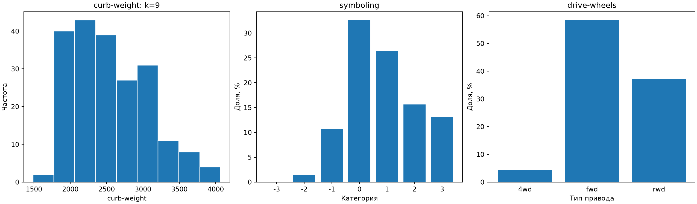
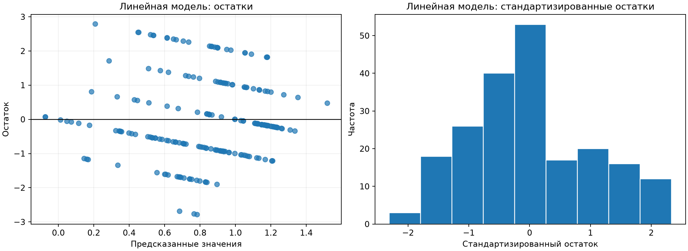
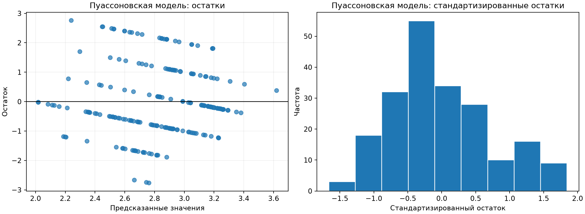
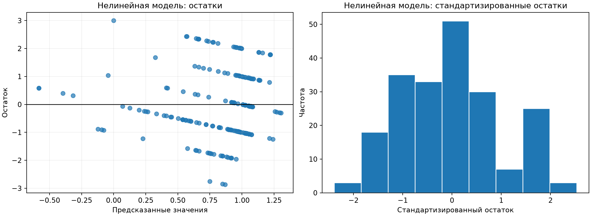

# Лабораторная работа 1.2. Регрессионный анализ

## 2. Цель работы

Изучить построение линейной, пуассоновской и нелинейной регрессионных моделей с фиктивными переменными, провести анализ остатков, оценить качество и статистическую значимость моделей.

## 3. Описание исходных данных

Использован набор **1985 Auto Imports** из первой части лабораторной работы. Рассматриваются 205 автомобилей и три признака:

- `symboling` - зависимая порядковая переменная страхового риска;
- `curb-weight` - независимая количественная переменная массы;
- `drive-wheels` - независимая категориальная переменная типа привода (`4wd`, `fwd`, `rwd`).

| Показатель | type | count | missing | unique |
| --- | --- | --- | --- | --- |
| symboling | ordinal | 205 | 0 | 6 |
| drive-wheels | nominal | 205 | 0 | 3 |
| curb-weight | quantitative | 205 | 0 | 171 |

Пропусков в выбранных переменных нет.

## 4. Результаты дескриптивного анализа

Для количественной переменной `curb-weight`:

| Показатель | curb-weight |
| --- | --- |
| count | 205 |
| mean | 2555.57 |
| median | 2414 |
| mode | 2385 |
| minimum | 1488 |
| maximum | 4066 |
| range | 2578 |
| variance | 271108 |
| standard_deviation | 520.68 |

Для категориальной зависимой переменной `symboling`:

| symboling | count | percent |
| --- | --- | --- |
| -3 | 0 | 0 |
| -2 | 3 | 1.46341 |
| -1 | 22 | 10.7317 |
| 0 | 67 | 32.6829 |
| 1 | 54 | 26.3415 |
| 2 | 32 | 15.6098 |
| 3 | 27 | 13.1707 |

Самая частая категория `symboling` - **0** (32.68%). Распределение типа привода:

| drive-wheels | count | percent |
| --- | --- | --- |
| 4wd | 9 | 4.39024 |
| fwd | 120 | 58.5366 |
| rwd | 76 | 37.0732 |

Число интервалов гистограммы массы рассчитано по формуле Стерджесса. Нормальность оценивается визуально: распределение массы несимметрично и имеет правый хвост.

## 5. Регрессионные модели

### Линейная регрессия с фиктивными переменными

Зависимая переменная - порядковая категория `symboling`. Модель МНК используется как учебное числовое приближение. Независимые переменные: масса и тип привода.

Уравнение модели:

`symboling_hat = 2.383559 -0.074321 * (curb-weight / 100) +0.241036 * I(drive-wheels = fwd) +0.563244 * I(drive-wheels = rwd)`

За базовую категорию типа привода принят `4wd`. Переменные `I(...)` равны 1 при выполнении условия и 0 в остальных случаях.

Коэффициенты и их значимость:

| Показатель | coefficient | standard_error | statistic | p_value | significant_0.05 |
| --- | --- | --- | --- | --- | --- |
| intercept | 2.38356 | 0.709855 | 3.35781 | 0.000939634 | True |
| curb_weight_100 | -0.0743209 | 0.0223543 | -3.32468 | 0.00105206 | True |
| drive_fwd | 0.241036 | 0.426533 | 0.565105 | 0.572632 | False |
| drive_rwd | 0.563244 | 0.437139 | 1.28848 | 0.199061 | False |

Показатели качества и значимости модели:

| Показатель | Значение |
| --- | --- |
| observations | 205 |
| parameters | 4 |
| r_squared | 0.0638574 |
| adjusted_r_squared | 0.0498851 |
| rmse | 1.20195 |
| mae | 0.957167 |
| f_statistic | 4.57029 |
| model_p_value | 0.00403788 |
| residual_mean | -6.58552e-16 |
| residual_variance | 1.45176 |

Среднее и дисперсия остатков по четырём группам предсказанных значений:

| fitted_group | count | mean | var |
| --- | --- | --- | --- |
| (-0.0761, 0.647] | 52 | 0.17166 | 1.58523 |
| (0.647, 0.885] | 51 | -0.357812 | 2.21796 |
| (0.885, 1.101] | 51 | 0.22129 | 1.39213 |
| (1.101, 1.519] | 51 | -0.0385031 | 0.483461 |

Максимальное по модулю групповое среднее остатка равно 0.358, отношение наибольшей групповой дисперсии к наименьшей - 4.588. Чем ближе средние к нулю и отношение дисперсий к единице, тем лучше выполняются предположения о постоянстве среднего и дисперсии остатков.

Групповые средние заметно отклоняются от нуля, а дисперсии различаются более чем вдвое; предположения о постоянстве среднего и дисперсии остатков выполняются плохо.

### Пуассоновская регрессия

Распределение Пуассона не допускает отрицательных значений, поэтому использован сдвиг `symboling + 2`, дающий значения от 0 до 5. Поскольку `symboling` является порядковой, а не счётной переменной, модель рассматривается как учебная и интерпретируется осторожно.

Уравнение модели:

`E(symboling + 2 | X) = exp(1.599942 -0.027193 * (curb-weight / 100) +0.090828 * I(drive-wheels = fwd) +0.207961 * I(drive-wheels = rwd))`

За базовую категорию типа привода принят `4wd`. Переменные `I(...)` равны 1 при выполнении условия и 0 в остальных случаях.

Коэффициенты и их значимость:

| Показатель | coefficient | standard_error | statistic | p_value | significant_0.05 | exp_coefficient |
| --- | --- | --- | --- | --- | --- | --- |
| intercept | 1.59994 | 0.361427 | 4.42673 | 9.56713e-06 | True | 4.95275 |
| curb_weight_100 | -0.0271926 | 0.0112919 | -2.40815 | 0.0160337 | True | 0.973174 |
| drive_fwd | 0.0908276 | 0.223249 | 0.406844 | 0.684122 | False | 1.09508 |
| drive_rwd | 0.207961 | 0.228154 | 0.911494 | 0.362035 | False | 1.23116 |

Показатели качества и значимости модели:

| Показатель | Значение |
| --- | --- |
| observations | 205 |
| parameters | 4 |
| converged | True |
| iterations | 5 |
| log_likelihood | -346.249 |
| deviance | 113.34 |
| aic | 700.498 |
| mcfadden_pseudo_r_squared | 0.0104473 |
| likelihood_ratio | 7.31113 |
| model_p_value | 0.0626151 |
| rmse_shifted_scale | 1.20145 |
| residual_mean | 1.725e-05 |
| residual_variance | 0.530354 |

Среднее и дисперсия остатков по четырём группам предсказанных значений:

| fitted_group | count | mean | var |
| --- | --- | --- | --- |
| (2.017, 2.631] | 52 | 0.16467 | 1.59078 |
| (2.631, 2.87] | 51 | -0.339253 | 2.21775 |
| (2.87, 3.106] | 51 | 0.230157 | 1.3924 |
| (3.106, 3.619] | 51 | -0.0588035 | 0.482371 |

Максимальное по модулю групповое среднее остатка равно 0.339, отношение наибольшей групповой дисперсии к наименьшей - 4.598. Чем ближе средние к нулю и отношение дисперсий к единице, тем лучше выполняются предположения о постоянстве среднего и дисперсии остатков.

Групповые средние заметно отклоняются от нуля, а дисперсии различаются более чем вдвое; предположения о постоянстве среднего и дисперсии остатков выполняются плохо.

### Нелинейная регрессия с фиктивными переменными

К линейной модели добавлен квадрат нормированной массы `(curb-weight / 100)^2`. Модель остаётся линейной по коэффициентам и оценивается методом наименьших квадратов.

Уравнение модели:

`symboling_hat = -0.269852 +0.120912 * (curb-weight / 100) -0.003537 * (curb-weight / 100)^2 +0.325904 * I(drive-wheels = fwd) +0.616819 * I(drive-wheels = rwd)`

За базовую категорию типа привода принят `4wd`. Переменные `I(...)` равны 1 при выполнении условия и 0 в остальных случаях.

Коэффициенты и их значимость:

| Показатель | coefficient | standard_error | statistic | p_value | significant_0.05 |
| --- | --- | --- | --- | --- | --- |
| intercept | -0.269852 | 2.08783 | -0.12925 | 0.89729 | False |
| curb_weight_100 | 0.120912 | 0.146218 | 0.826931 | 0.409262 | False |
| curb_weight_100_squared | -0.00353704 | 0.00261802 | -1.35104 | 0.17821 | False |
| drive_fwd | 0.325904 | 0.43027 | 0.757441 | 0.449677 | False |
| drive_rwd | 0.616819 | 0.438043 | 1.40813 | 0.160646 | False |

Показатели качества и значимости модели:

| Показатель | Значение |
| --- | --- |
| observations | 205 |
| parameters | 5 |
| r_squared | 0.0723239 |
| adjusted_r_squared | 0.0537703 |
| rmse | 1.1965 |
| mae | 0.946191 |
| f_statistic | 3.89812 |
| model_p_value | 0.00452027 |
| residual_mean | 8.75527e-14 |
| residual_variance | 1.43863 |

Среднее и дисперсия остатков по четырём группам предсказанных значений:

| fitted_group | count | mean | var |
| --- | --- | --- | --- |
| (-0.585, 0.721] | 53 | 0.127749 | 1.41693 |
| (0.721, 0.954] | 50 | -0.394061 | 2.32895 |
| (0.954, 1.056] | 51 | 0.0138466 | 1.22784 |
| (1.056, 1.306] | 51 | 0.239729 | 0.654402 |

Максимальное по модулю групповое среднее остатка равно 0.394, отношение наибольшей групповой дисперсии к наименьшей - 3.559. Чем ближе средние к нулю и отношение дисперсий к единице, тем лучше выполняются предположения о постоянстве среднего и дисперсии остатков.

Групповые средние заметно отклоняются от нуля, а дисперсии различаются более чем вдвое; предположения о постоянстве среднего и дисперсии остатков выполняются плохо.

## 6. Сравнительный анализ и интерпретация

Сводная таблица рассчитанных показателей:

| model | quality_measure | quality_value | adjusted_r_squared | rmse | aic | model_p_value | significant_0.05 |
| --- | --- | --- | --- | --- | --- | --- | --- |
| linear | R-squared | 0.0638574 | 0.0498851 | 1.20195 | nan | 0.00403788 | True |
| nonlinear | R-squared | 0.0723239 | 0.0537703 | 1.1965 | nan | 0.00452027 | True |
| poisson | McFadden pseudo-R-squared | 0.0104473 | nan | 1.20145 | 700.498 | 0.0626151 | False |

Линейная модель: R² = 0.0639, скорректированный R² = 0.0499, p модели = 0.00403788.

Нелинейная модель: R² = 0.0723, скорректированный R² = 0.0538, p модели = 0.00452027.

Пуассоновская модель сошлась за 5 итераций; псевдо-R² Мак-Фаддена = 0.0104, p модели = 0.0626151. Этот показатель нельзя напрямую сравнивать с обычным R² моделей МНК.

По скорректированному R² среди моделей МНК предпочтительна **нелинейная модель**. Качество всех моделей оценивается совместно по метрикам и графикам остатков. Наличие структуры или изменения разброса остатков указывает на неполное описание зависимости.

Обе модели МНК объясняют менее 8% разброса `symboling`, поэтому их практическая предсказательная способность низкая. Добавление квадрата массы повышает скорректированный R² лишь примерно на 0.0039, а коэффициент квадратного члена статистически незначим. Пуассоновская модель в целом незначима при α = 0.05. На графиках остатки образуют полосы из-за дискретных уровней зависимой переменной; групповые дисперсии заметно различаются.

Полученные связи не доказывают причинного влияния массы или типа привода на страховой риск. Кроме того, `symboling` является порядковой категорией, поэтому линейная и пуассоновская регрессии здесь выполняют учебную функцию; для строгого моделирования естественнее порядковая логистическая регрессия.
