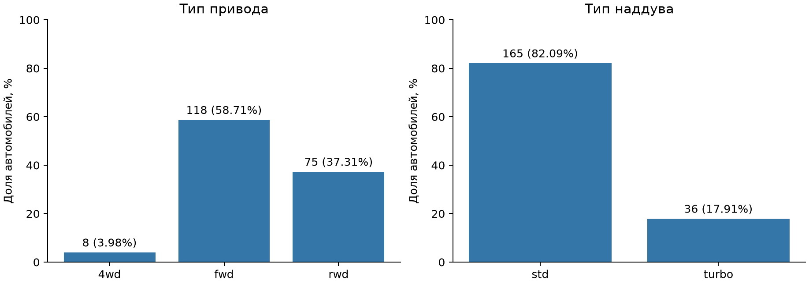
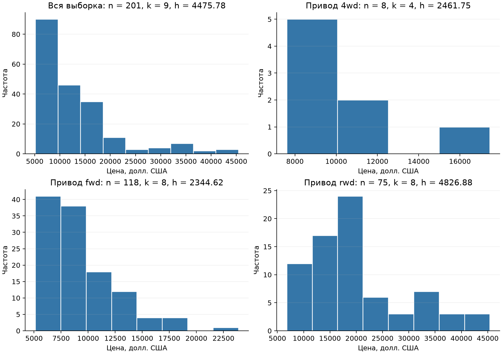
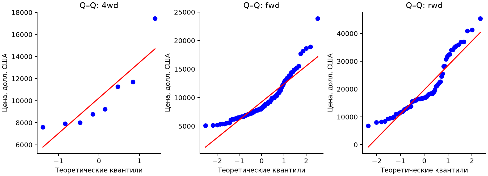
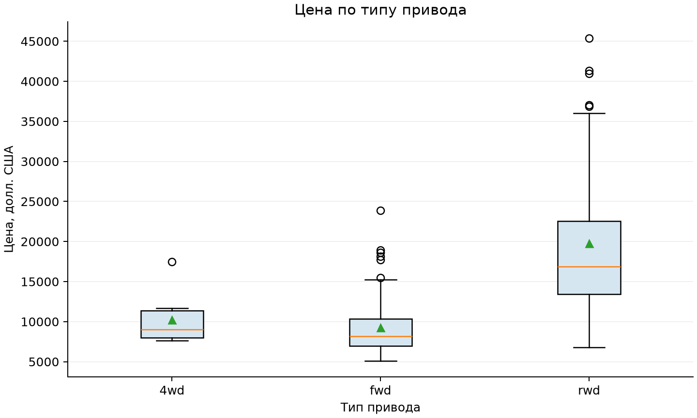
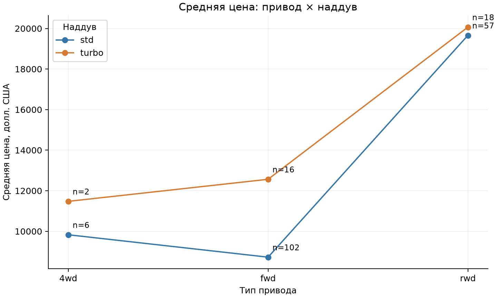
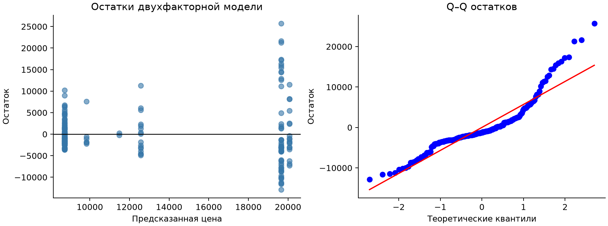

# Лабораторная работа 1.3. Дисперсионный анализ

## Цель работы

Изучить однофакторный дисперсионный анализ: сравнить цену автомобилей с разными типами привода, проверить условия применения ANOVA и выполнить критерий Краскела–Уоллиса. В дополнительном задании провести двухфакторный анализ цены по типу привода и наддуву двигателя.

## 1 Описание исходных данных

Пункт 1 задания выполнен заново для выбранной зависимой переменной price. Использован тот же набор 1985 Auto Imports («Automobile»), что и в лабораторных работах 1.1 и 1.2. Исходный файл lab1/data/imports-85.data содержит 205 записей и 26 признаков: технические характеристики автомобилей, цену и страховые показатели. Одна строка соответствует записи об автомобиле в каталоге; данные не являются временным рядом.

price — зависимая количественная переменная, цена автомобиля в долларах США. Для сравнения групп она используется в исходной числовой шкале. Ценовые интервалы применяются только при построении гистограмм.

drive-wheels — независимая номинальная переменная, тип привода: 4wd — полный, fwd — передний, rwd — задний. Этот фактор используется в однофакторном и двухфакторном анализе.

aspiration — второй независимый номинальный фактор для пункта 10: std — стандартное исполнение без турбонаддува, turbo — турбонаддув. Выбор обусловлен техническим смыслом признака, отсутствием пропусков и наличием всех шести сочетаний с типом привода.

Таблица 1. Проверка выбранных переменных до и после обработки пропусков

| Признак | Тип | Всего | Заполнено | Пропуски | В анализе |
| --- | --- | --- | --- | --- | --- |
| price | количественный | 205 | 201 | 4 | 201 |
| drive-wheels | номинальный | 205 | 205 | 0 | 201 |
| aspiration | номинальный | 205 | 205 | 0 | 201 |

Знак «?» в исходном файле распознаётся как пропуск. Цена отсутствует в четырёх строках (номера строк исходного файла: 10, 45, 46, 130). Эти строки исключены по правилу полных наблюдений для выбранных переменных; цена не заполняется средним значением. Во всех дальнейших расчётах используется одна и та же выборка из 201 автомобиля. Пропуски в других, неиспользуемых признаках не служат причиной исключения строк. Наблюдаемые высокие цены сохранены как часть исходных данных.

Среда выполнения — Python. Использованы pandas и NumPy для подготовки данных, SciPy для статистических критериев, statsmodels для двухфакторной модели и matplotlib для графиков. Во всех проверках уровень значимости α = 0,05.

## 2 Результаты дескриптивного анализа

Раздел выполняет пункты 2 и 3 задания. Все характеристики рассчитаны заново для price и сформированных групп. Дисперсия и стандартное отклонение являются выборочными (делитель n − 1).

### 2.1 Числовые характеристики цены

Таблица 2. Дескриптивные показатели price в целом и по типу привода

| Показатель | Вся выборка | 4wd | fwd | rwd |
| --- | --- | --- | --- | --- |
| Число наблюдений | 201 | 8 | 118 | 75 |
| Среднее, долл. | 13 207,13 | 10 241,00 | 9 244,78 | 19 757,61 |
| Медиана, долл. | 10 295,00 | 9 005,50 | 8 192,00 | 16 900,00 |
| Минимум, долл. | 5 118 | 7 603 | 5 118 | 6 785 |
| Максимум, долл. | 45 400 | 17 450 | 23 875 | 45 400 |
| Размах, долл. | 40 282 | 9 847 | 18 757 | 38 615 |
| Дисперсия, долл.² | 63 155 863,44 | 10 812 332,00 | 11 195 035,15 | 82 493 181,86 |
| Стандартное отклонение, долл. | 7 947,07 | 3 288,21 | 3 345,90 | 9 082,58 |
| Первый квартиль, долл. | 7 775,00 | 7 984,25 | 6 950,75 | 13 455,00 |
| Третий квартиль, долл. | 16 500,00 | 11 367,75 | 10 332,50 | 22 547,50 |
| Межквартильный размах, долл. | 8 725,00 | 3 383,50 | 3 381,75 | 9 092,50 |
| Асимметрия | 1,810 | 1,780 | 1,594 | 1,027 |

Моды цены всей выборки: 5572, 6229, 6692, 7295, 7609, 7775, 7898, 7957, 8495, 8845, 8921, 9279, 13499, 16500, 18150 долл. Средняя цена равна 13 207,13 долл., медиана — 10 295,00 долл. Среднее выше медианы, что соответствует правосторонней асимметрии. Большая величина дисперсии связана с измерением в долларах²; для оценки разброса удобнее стандартное отклонение. Цены в группе rwd имеют наибольшие среднее, медиану и стандартное отклонение.

Таблица 3. Частоты категорий факторов в анализируемой выборке

| Фактор | Категория | Число автомобилей | Доля, % |
| --- | --- | --- | --- |
| drive-wheels | 4wd | 8 | 3,98 |
| drive-wheels | fwd | 118 | 58,71 |
| drive-wheels | rwd | 75 | 37,31 |
| aspiration | std | 165 | 82,09 |
| aspiration | turbo | 36 | 17,91 |

### 2.2 Гистограммы и формула Стерджесса

`k = ceil(1 + log₂ n);     h = (xₘₐₓ − xₘᵢₙ) / k`

Здесь k — число интервалов, округлённое вверх, h — длина интервала. Расчёт выполнен по наблюдаемому диапазону цены отдельно для всей выборки и каждой группы привода. Интервалы замкнуты слева и открыты справа; последний интервал включает максимум.

Таблица 4. Параметры гистограмм price по формуле Стерджесса

| Выборка | n | Минимум | Максимум | k | h, долл. |
| --- | --- | --- | --- | --- | --- |
| вся выборка | 201 | 5 118 | 45 400 | 9 | 4 475,78 |
| 4wd | 8 | 7 603 | 17 450 | 4 | 2 461,75 |
| fwd | 118 | 5 118 | 23 875 | 8 | 2 344,62 |
| rwd | 75 | 6 785 | 45 400 | 8 | 4 826,88 |

По гистограммам видны асимметрия и высокие значения в правом хвосте. Номинальные факторы drive-wheels и aspiration изображены столбчатыми диаграммами частот: у их категорий нет числовой длины интервала и к ним неприменима формула Стерджесса.

### 2.3 Оценка нормальности и равенства дисперсий

Для ANOVA существенна нормальность распределения ошибок внутри групп, поэтому проверены отдельные выборки price по приводу. Общая цена проверена дополнительно для описания данных. Использованы Q–Q-графики и критерий Шапиро–Уилка: H₀ — нормальное распределение, H₁ — отклонение от него. При p < 0,05 H₀ отвергается.

Таблица 5. Проверка нормальности цены критерием Шапиро–Уилка

| Выборка | n | W | p-value | Вывод при α = 0,05 |
| --- | --- | --- | --- | --- |
| вся выборка | 201 | 0,7985 | 2,216e-15 | нормальность отвергается |
| 4wd | 8 | 0,7942 | 0,02477 | нормальность отвергается |
| fwd | 118 | 0,8623 | 4,388e-09 | нормальность отвергается |
| rwd | 75 | 0,8909 | 9,296e-06 | нормальность отвергается |

Нормальность отвергается во всех трёх группах при α = 0,05. На Q–Q-графиках точки отклоняются от прямой, особенно в хвостах. Для 4wd вывод ограничен малым объёмом — 8 наблюдений.

Равенство дисперсий проверено критерием Левена с центром в медиане (вариант Брауна–Форсайта). H₀: σ²₄wd = σ²fwd = σ²rwd. Получены F = 18,4887, df = (2; 198), p = 4,348e-08; H₀ отвергается. Отношение максимальной выборочной дисперсии к минимальной равно 7,630. Таким образом, обычная ANOVA нарушает условия нормальности и однородности дисперсий.

## 3 Правила применения методов и обоснование выбора

Пункт 4 задания. Однофакторная ANOVA Фишера применяется для сравнения средних количественного признака в нескольких независимых группах. Предполагаются независимость наблюдений, нормальность ошибок внутри групп и одинаковые генеральные дисперсии. Нормальность смеси всех групп не является отдельным обязательным условием. Неравные размеры групп допустимы, но в сочетании с разными дисперсиями ухудшают надёжность обычного F-теста.

По условию работы выполняется классическая однофакторная ANOVA с F-статистикой Фишера. Её результат сопоставляется с ANOVA Уэлча, допускающей неодинаковые дисперсии и сравнивающей средние, и с ранговым критерием Краскела–Уоллиса. Уэлч устраняет предположение о равенстве дисперсий, но не гарантирует точность при произвольной форме распределения и малой группе 4wd.

Критерий Краскела–Уоллиса применяется к независимым группам числовых или порядковых наблюдений. Нормальность не требуется; в расчёте используются ранги и поправка на совпадающие значения. Для χ²-приближения желательно не менее пяти наблюдений в каждой группе: здесь минимум равен восьми. При одинаковой форме и разбросе распределений его можно трактовать как проверку различия положения, в частности медиан. Здесь разброс различается, поэтому основной вывод относится к распределениям и рангам, а не только к медианам.

Двухфакторная ANOVA оценивает два категориальных фактора и их взаимодействие. Для модели с взаимодействием нужны наблюдения в каждой комбинации факторов и остаточные степени свободы. При несбалансированном плане способ расчёта сумм квадратов необходимо указывать. Здесь используются частные суммы квадратов типа III и контрасты с нулевой суммой; дополнительно проводятся F-проверки с робастной ковариационной матрицей HC3 [7].

Независимость рассматривается как рабочее предположение: запись входит в выборку один раз и относится только к одной группе. По таблице нельзя доказать независимость; автомобили одной марки могут иметь сходные характеристики. Выборка каталога не является подтверждённой случайной выборкой рынка, поэтому выводы прежде всего описывают исследуемые данные.

## 4 Формулировка гипотез

Пункт 5 задания. Для однофакторного анализа цены формулируются гипотезы:

`H₀: μ₄wd = μfwd = μrwd;     H₁: хотя бы одно среднее отличается.`

μ — генеральное математическое ожидание цены для соответствующего типа привода. H₁ не утверждает, что различаются все пары групп. Правило решения: отвергнуть H₀, если p < α = 0,05, или, эквивалентно, если Fнабл > Fкрит. Если p ≥ α, оснований отвергать H₀ недостаточно; это не доказывает равенство средних.

Для Краскела–Уоллиса H₀: распределения цены в группах одинаковы; H₁: хотя бы одна группа имеет отличающееся распределение. При совпадающих формах распределений это становится гипотезой об одинаковом положении. Правило решения: p < 0,05 или Hнабл > χ²крит(2).

Для двухфакторной модели отдельно проверяются H₀A — отсутствие эффекта типа привода, H₀B — отсутствие эффекта наддува и H₀AB — отсутствие взаимодействия. Альтернативы предполагают наличие соответствующего эффекта. При контрастах с нулевой суммой эффекты A и B относятся к средним, усреднённым с одинаковыми весами по уровням другого фактора. Взаимодействие означает, что разность средних цен turbo и std зависит от типа привода.

## 5 Градации фактора и формирование групп

Пункт 6 задания. drive-wheels является номинальным фактором с тремя готовыми градациями. Разбиение на числовые интервалы не требуется. Для каждой категории из очищенного набора отобраны соответствующие цены: 4wd — 8 значений, fwd — 118 значений, rwd — 75 значений. Группы не пересекаются и вместе включают все 201 наблюдение. Доли рассчитаны после исключения пропусков, поэтому отличаются от частот по 205 записям в прошлых работах.

Полные числовые ряды сохранены в results/price_groups.csv: каждый столбец содержит цены одной группы. Пустые клетки в конце коротких столбцов обозначают разные размеры групп, а не пропуски цены в анализируемых наблюдениях.

## 6 Результаты однофакторного дисперсионного анализа

### 6.1 Расчёт F-статистики Фишера

Пункты 7 и 8 задания. Межгрупповая сумма квадратов отражает отклонения групповых средних от общего среднего с весами, равными размерам групп. Внутригрупповая сумма квадратов отражает разброс цен относительно среднего своей группы.

`SSмеж = Σ nⱼ(ȳⱼ − ȳ)²;     SSвнутр = ΣΣ(yᵢⱼ − ȳⱼ)²`

`SSобщ = SSмеж + SSвнутр;     F = [SSмеж / (k − 1)] / [SSвнутр / (N − k)]`

В данном случае N = 201, k = 3; степени свободы между группами равны 2, внутри групп — 198, общие — 200. Расчёт по суммам квадратов независимо сверяется с scipy.stats.f_oneway.

Таблица 6. Однофакторная ANOVA цены по типу привода

| Источник | SS, млн долл.² | df | MS, млн долл.² | F | p-value |
| --- | --- | --- | --- | --- | --- |
| Между группами | 5 141,1718 | 2 | 2 570,5859 | 67,9541 | 3,395e-23 |
| Внутри групп | 7 490,0009 | 198 | 37,8283 | — | — |
| Общая | 12 631,1727 | 200 | — | — | — |

Fнабл = 67,9541, Fкрит(2; 198; 0,95) = 3,0415; p = 3,395e-23. Fнабл > Fкрит и p < 0,05, поэтому нулевая гипотеза равенства всех средних отвергается. С учётом нарушенных предпосылок этот вывод необходимо проверить устойчивыми методами.

Доля межгрупповой вариации η² = SSмеж / SSобщ = 0,4070 (40,70% общего разброса цены). Скорректированная оценка ω² = [SSмеж − (k − 1)MSвнутр] / [SSобщ + MSвнутр] = 0,3998. Это характеристики связи в выборке, а не доля доказанного причинного влияния привода.

### 6.2 Проверка устойчивости: ANOVA Уэлча

Таблица 7. Однофакторный анализ Уэлча при неодинаковых дисперсиях

| F Уэлча | df₁ | df₂ | Fкрит | p-value |
| --- | --- | --- | --- | --- |
| 44,7198 | 2 | 19,3559 | 3,5112 | 5,540e-08 |

Уэлч также отвергает H₀: p = 5,540e-08 < 0,05. Следовательно, вывод о различии средних сохраняется при отказе от предположения об одинаковых дисперсиях.

Таблица 8. Попарные двусторонние t-тесты Уэлча с поправкой Холма

| Пара | Разность средних, долл. | t | df | p Холма | Значимо |
| --- | --- | --- | --- | --- | --- |
| 4wd − fwd | 996,22 | 0,8283 | 8,015 | 0,43145 | нет |
| 4wd − rwd | -9 516,61 | -6,0781 | 21,672 | 8,663e-06 | да |
| fwd − rwd | -10 512,83 | -9,6178 | 86,907 | 7,395e-15 | да |

Попарные сравнения выполнены дополнительно, чтобы определить источник различий. Поправка Холма контролирует ошибку первого рода в семействе трёх сравнений. Средняя цена rwd выше средней цены 4wd на 9 516,61 долл. и fwd на 10 512,83 долл.; оба различия значимы после поправки. Различие 4wd и fwd незначимо. Это не означает, что их генеральные средние доказанно равны.

## 7 Результаты критерия Краскела–Уоллиса

Пункт 9 задания. Все 201 значение цены ранжировано совместно от меньшего к большему. Совпадающим ценам назначены средние ранги; затем рассчитаны суммы рангов по группам.

`H* = [12 / (N(N + 1))] Σ(Rⱼ² / nⱼ) − 3(N + 1)`

`C = 1 − Σ(t³ − t)/(N³ − N);     H = H* / C`

Rⱼ — сумма рангов группы j, t — число повторений одной цены, C — поправка на совпадающие значения. Статистика H сравнивается с распределением χ² с k − 1 = 2 степенями свободы. Ручной расчёт с поправкой сверяется с scipy.stats.kruskal.

Таблица 9. Ранги цены по типу привода

| Тип привода | n | Сумма рангов | Средний ранг |
| --- | --- | --- | --- |
| 4wd | 8 | 707,5 | 88,438 |
| fwd | 118 | 8 185,0 | 69,364 |
| rwd | 75 | 11 408,5 | 152,113 |

Таблица 10. Критерий Краскела–Уоллиса с поправкой на совпадения

| H* | C | H | df | χ²крит | p-value |
| --- | --- | --- | --- | --- | --- |
| 93,1879 | 0,999989 | 93,1889 | 2 | 5,9915 | 5,811e-21 |

H = 93,1889 > χ²крит = 5,9915; p = 5,811e-21 < 0,05. H₀ об одинаковых распределениях отвергается. Наибольший средний ранг имеет группа rwd, что соответствует более высоким ценам в этой группе. Из-за неодинакового разброса результат нельзя сводить к доказательству различия только медиан или использовать как прямую проверку равенства математических ожиданий.

Таблица 11. Попарные сравнения рангов: критерий Данна с поправкой Холма

| Пара | z | p Холма | Значимо при α = 0,05 |
| --- | --- | --- | --- |
| 4wd − fwd | 0,8975 | 0,36944 | нет |
| 4wd − rwd | -2,9433 | 0,00650 | да |
| fwd − rwd | -9,6333 | 1,735e-21 | да |

Ранговые попарные сравнения подтверждают отличия rwd от 4wd и fwd; отличие 4wd от fwd не подтверждается. Тем самым параметрические и ранговые процедуры дают согласованную картину при различающихся проверяемых гипотезах.

## 8 Дополнительное задание: двухфакторный дисперсионный анализ

### 8.1 Факторы, план и модель

Пункт 10 задания. Зависимая переменная — price. Фактор A — drive-wheels с тремя уровнями; фактор B — aspiration с двумя уровнями. Анализ выполнен на тех же 201 наблюдении. Все шесть комбинаций присутствуют, но размеры ячеек различаются.

Таблица 12. Число наблюдений и цена для сочетаний привода и наддува

| Привод | Наддув | n | Средняя, долл. | Медиана, долл. | Ст. откл., долл. |
| --- | --- | --- | --- | --- | --- |
| 4wd | std | 6 | 9 829,17 | 8 395,50 | 3 782,09 |
| 4wd | turbo | 2 | 11 476,50 | 11 476,50 | 307,59 |
| fwd | std | 102 | 8 724,03 | 7 896,50 | 2 790,44 |
| fwd | turbo | 16 | 12 564,56 | 11 663,50 | 4 614,34 |
| rwd | std | 57 | 19 660,25 | 16 515,00 | 10 009,06 |
| rwd | turbo | 18 | 20 065,94 | 18 685,00 | 5 380,22 |

`priceᵢⱼₖ = μ + Aᵢ + Bⱼ + (AB)ᵢⱼ + εᵢⱼₖ`

μ — общий уровень цены; Aᵢ и Bⱼ — эффекты факторов; (AB)ᵢⱼ — взаимодействие; ε — ошибка. Модель оценивается методом наименьших квадратов с формулой price ~ C(drive, Sum) * C(aspiration, Sum). Использованы контрасты с нулевой суммой, чтобы в таблице типа III главные эффекты соответствовали сравнению средних с равными весами уровней второго фактора. Частные суммы квадратов типа III в несбалансированном плане не обязаны складываться в общую сумму квадратов.

Матрица модели имеет полный ранг; оценены 6 параметров. Остаточные степени свободы равны 201 − 6 = 195. R² = 0,4237, скорректированный R² = 0,4089. Для ячейки 4wd × turbo имеются только 2 наблюдения: это позволяет оценить полную модель, но делает выводы по этой комбинации неточными.

### 8.2 Классическая ANOVA типа III

Таблица 13. Двухфакторная ANOVA типа III для price

| Эффект | SSчастн., млн долл.² | df | MS, млн долл.² | F | p-value |
| --- | --- | --- | --- | --- | --- |
| Привод A | 2 457,0691 | 2 | 1 228,5345 | 32,9086 | 4,848e-13 |
| Наддув B | 42,7723 | 1 | 42,7723 | 1,1457 | 0,28577 |
| Взаимодействие A × B | 81,4753 | 2 | 40,7376 | 1,0912 | 0,33784 |
| Остаток | 7 279,6829 | 195 | 37,3317 | — | — |

Эффект привода значим: F(2; 195) = 32,9086, p = 4,848e-13; H₀A отвергается. Эффект наддува незначим: F(1; 195) = 1,1457, p = 0,28577; H₀B не отвергается. Взаимодействие незначимо: F(2; 195) = 1,0912, p = 0,33784; H₀AB не отвергается. Отсутствие значимости не доказывает отсутствия соответствующего эффекта.

Непараллельность линий на графике показывает различающиеся выборочные разности turbo − std, но сама по себе не доказывает взаимодействия: для этого используется его статистическая проверка.

### 8.3 Проверка предпосылок и робастный анализ HC3

Для шести ячеек критерий Левена с центром в медиане даёт F(5; 195) = 9,5013, p = 3,989e-08. Шапиро–Уилк для остатков модели: W = 0,8765, p = 9,323e-12. Условия равенства дисперсий и нормальности ошибок не выполняются. Поэтому классическая таблица дополняется проверками тех же эффектов с робастной ковариацией HC3. Для ячейки из двух наблюдений критерий Шапиро–Уилка не рассчитывается, поскольку требуется не менее трёх значений.

Таблица 14. F-проверки эффектов двухфакторной модели с ковариацией HC3

| Эффект | df₁ | df₂ | F HC3 | p-value | Значимо |
| --- | --- | --- | --- | --- | --- |
| Привод A | 2 | 195 | 37,8728 | 1,269e-14 | да |
| Наддув B | 1 | 195 | 4,3725 | 0,03782 | да |
| Взаимодействие A × B | 2 | 195 | 1,3514 | 0,26128 | нет |

Вывод о приводе сохраняется при HC3: p = 1,269e-14. Взаимодействие также не подтверждается: p = 0,26128. Для наддува HC3 даёт p = 0,03782 < 0,05, тогда как классический тест даёт p = 0,28577. Таким образом, вывод о наддуве чувствителен к учёту неодинаковых дисперсий. Его нельзя представлять как устойчиво установленный или отсутствующий эффект. HC3 использует приближённую проверку и не устраняет проблему малой ячейки 4wd × turbo и отклонений от нормальности. По главным эффектам показаны отдельные проверки при α = 0,05; в отличие от попарных сравнений, общая поправка на три эффекта здесь не применяется.

## 9 Интерпретация результатов и выводы

Таблица 15. Сопоставление однофакторных проверок

| Метод | Статистика | p-value | Вывод при α = 0,05 |
| --- | --- | --- | --- |
| ANOVA Фишера | 67,9541 | 3,395e-23 | равенство средних отвергается |
| ANOVA Уэлча | 44,7198 | 5,540e-08 | равенство средних отвергается |
| Краскел–Уоллис | 93,1889 | 5,811e-21 | равенство распределений отвергается |

1. Цена автомобиля price является количественной зависимой переменной. После исключения четырёх неизвестных цен выполнен новый дескриптивный анализ 201 наблюдения, построены гистограммы с интервалами Стерджесса и проверены распределения в группах.

2. В исследуемом наборе цена связана с типом привода. Обычная ANOVA выявляет различия средних; анализ Уэлча подтверждает этот вывод при неодинаковых дисперсиях. Критерий Краскела–Уоллиса независимо подтверждает различия распределений цены.

3. Средние цены равны: 4wd — 10 241,00 долл., fwd — 9 244,78 долл., rwd — 19 757,61 долл. Попарные проверки Уэлча и Данна с поправкой Холма показывают, что rwd отличается от двух других групп. Различие 4wd и fwd статистически не подтверждено.

4. В двухфакторной модели с наддувом значимость привода сохраняется, а взаимодействие не подтверждено ни обычной, ни робастной проверкой. Вывод о наддуве зависит от метода: классическая ANOVA типа III не отвергает H₀B, HC3 отвергает её при 0,05. Результат по этому фактору требует осторожной интерпретации из-за несбалансированного плана, неодинаковых дисперсий и малой ячейки.

5. Выявленные различия не доказывают причинного влияния привода или наддува на цену. Группы могут различаться по марке, классу, мощности и комплектации; эти признаки не контролировались. Результаты относятся к историческим данным каталога, а не к актуальным рыночным ценам автомобилей.

## Список использованных материалов

1. Задание «Лабораторная работа 1.3. Дисперсионный анализ». [ЛР1.3.pdf](ЛР1.3.pdf)

2. Описание исходного набора 1985 Auto Imports. [../lab1/data/imports-85.names](../lab1/data/imports-85.names)

3. SciPy: однофакторный анализ Фишера и Уэлча. [https://docs.scipy.org/doc/scipy/reference/generated/scipy.stats.f_oneway.html](https://docs.scipy.org/doc/scipy/reference/generated/scipy.stats.f_oneway.html)

4. SciPy: критерий Шапиро–Уилка. [https://docs.scipy.org/doc/scipy/reference/generated/scipy.stats.shapiro.html](https://docs.scipy.org/doc/scipy/reference/generated/scipy.stats.shapiro.html)

5. SciPy: критерий Левена. [https://docs.scipy.org/doc/scipy/reference/generated/scipy.stats.levene.html](https://docs.scipy.org/doc/scipy/reference/generated/scipy.stats.levene.html)

6. SciPy: критерий Краскела–Уоллиса. [https://docs.scipy.org/doc/scipy/reference/generated/scipy.stats.kruskal.html](https://docs.scipy.org/doc/scipy/reference/generated/scipy.stats.kruskal.html)

7. statsmodels: таблицы ANOVA и робастная ковариация HC3. [https://www.statsmodels.org/stable/generated/statsmodels.stats.anova.anova_lm.html](https://www.statsmodels.org/stable/generated/statsmodels.stats.anova.anova_lm.html)

8. statsmodels: поправки на множественные сравнения. [https://www.statsmodels.org/stable/generated/statsmodels.stats.multitest.multipletests.html](https://www.statsmodels.org/stable/generated/statsmodels.stats.multitest.multipletests.html)

## Приложение. Воспроизведение расчётов

Расчёты выполняются файлом anova_analysis.py. Отчёты REPORT.md и Отчёт_ЛР1.3_Дисперсионный_анализ.docx собираются файлом build_report.py из сохранённых CSV, PNG и summary.json. Команды запуска приведены в README.md. Файл results/analysis_data.csv содержит очищенные данные с номерами исходных строк; results/excluded_rows.csv — исключённые строки.

Контроль вычислений: суммы квадратов однофакторной модели сверены с общим разбросом; F Фишера, F Уэлча и H Краскела–Уоллиса независимо рассчитаны по формулам и сопоставлены с SciPy. Частные F двухфакторной модели сверены с вложенными моделями, оценёнными через numpy.linalg.lstsq. Все проверки выполнены успешно.
