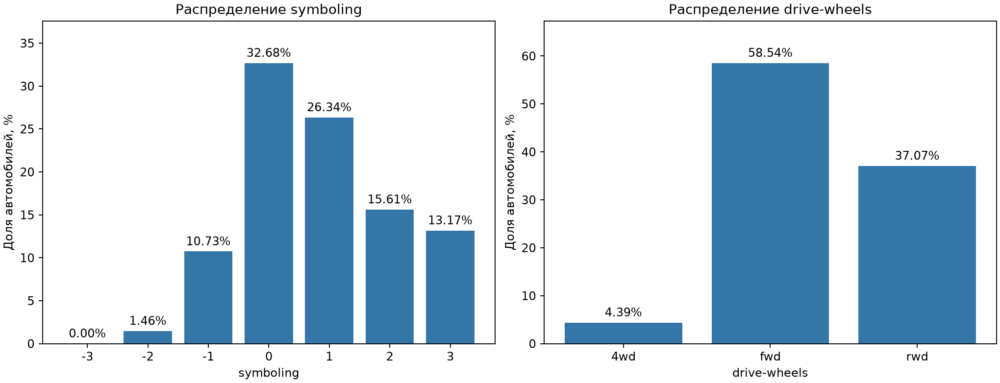
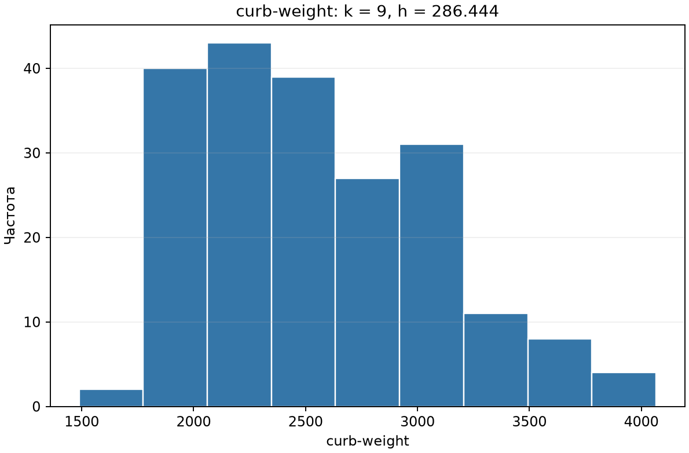
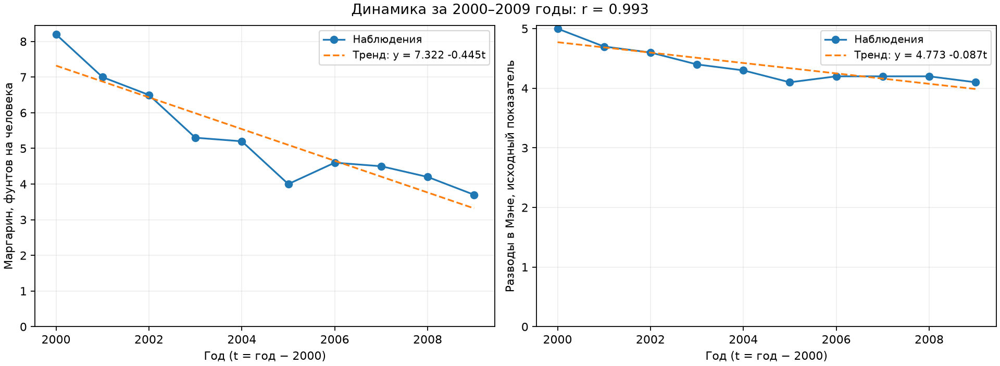
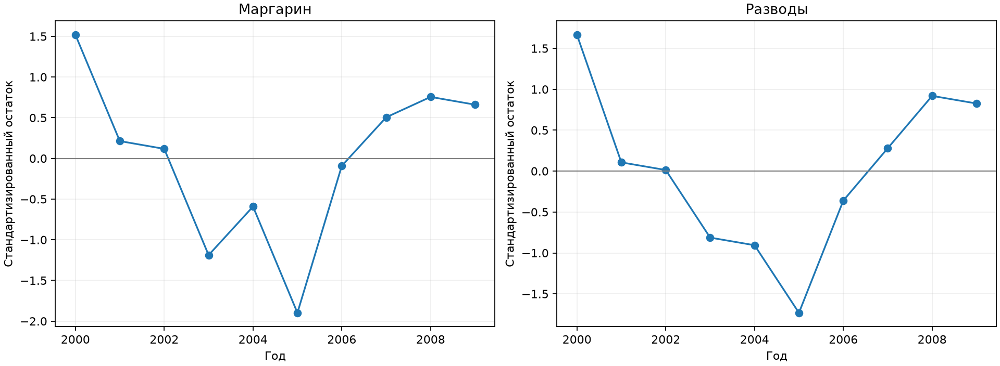
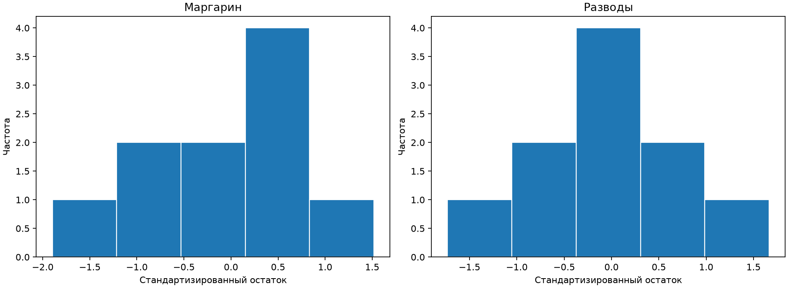

# Лабораторная работа №1

**Дисциплина:** Методы анализа данных  
**Тема:** Описательная статистика. Корреляционный анализ  
**Среда выполнения:** Python, pandas, NumPy, Matplotlib, SciPy

## 2. Цель работы

Изучить методы дескриптивного и корреляционного анализа: описать выбранные признаки,
оценить форму распределения массы по гистограмме, составить таблицу сопряжённости,
определить направление, силу и значимость связи признаков. На отдельном примере
рассмотреть ложную корреляцию и ограничения причинной интерпретации.

## 3. Описание исходных данных

Источник: локальный архив automobile.zip, файлы imports-85.data и imports-85.names.
Набор 1985 Auto Imports содержит 205 строк и 26 столбцов, без заголовка; разделитель - запятая, пропуски обозначаются `?`.

- `symboling`: зависимая порядковая переменная, оценка страхового риска. Чем выше значение, тем выше риск относительно ожидаемого по цене автомобиля. Допустимы уровни от -3 до 3; фактически наблюдаются от -2 до 3.
- `drive-wheels`: независимая номинальная переменная, тип привода: 4wd - полный, fwd - передний, rwd - задний.
- `curb-weight`: независимая количественная переменная, снаряжённая масса автомобиля. Значения приводятся в исходной шкале: файл .names не указывает единицу измерения.

Назначение переменных зависимыми и независимыми задаёт дальнейшую постановку анализа, само по себе не означает причинную связь.

### 3.1. Проверка данных

| Показатель | Тип | Наблюдений | Пропусков | Уникальных значений |
| --- | --- | --- | --- | --- |
| symboling | порядковый | 205 | 0 | 6 |
| drive-wheels | номинальный | 205 | 0 | 3 |
| curb-weight | количественный | 205 | 0 | 171 |

В выбранных столбцах пропусков нет; все 205 строк сохранены. Пропуски других столбцов не являются основанием удалять строки для этого анализа.
Полных повторов строк исходного набора: 0. Повторов комбинаций трёх выбранных признаков: 22; совпадение признаков не доказывает повтор объекта, поэтому такие строки сохранены.

## 4. Результаты дескриптивного анализа

| Показатель | curb-weight |
| --- | --- |
| n | 205 |
| Среднее | 2555.57 |
| Медиана | 2414 |
| Моды | 2385 |
| Минимум | 1488 |
| Максимум | 4066 |
| Размах | 2578 |
| Дисперсия (ddof=1) | 271108 |
| Станд. отклонение (ddof=1) | 520.68 |

Выборочные дисперсия и стандартное отклонение рассчитаны с делителем n-1.
Числовые описательные статистики рассчитаны только для `curb-weight`.
Категориальные `symboling` (порядковая) и `drive-wheels` (номинальная) описываются частотами и процентными долями. Доля категории равна её частоте, делённой на число автомобилей и умноженной на 100%.

### Частоты symboling

| symboling | Частота | Доля, % |
| --- | --- | --- |
| -3 | 0 | 0 |
| -2 | 3 | 1.46341 |
| -1 | 22 | 10.7317 |
| 0 | 67 | 32.6829 |
| 1 | 54 | 26.3415 |
| 2 | 32 | 15.6098 |
| 3 | 27 | 13.1707 |

Самый частый уровень symboling: 0; число автомобилей - 67, доля - 32.68%.

### Частоты drive-wheels

| drive-wheels | Частота | Доля, % |
| --- | --- | --- |
| 4wd | 9 | 4.39024 |
| fwd | 120 | 58.5366 |
| rwd | 76 | 37.0732 |

### Гистограмма массы и формула Стерджесса

Число интервалов k = ceil(1 + log2(n)) = 9; длина интервала h = (max - min) / k.
При n = 205 для массы h = 286.444444.
Использован наблюдаемый диапазон, а не теоретический. Интервалы замкнуты слева и открыты справа; последний включает максимум.
Границы и частоты сохранены в [таблице интервалов](results/statistics/histogram_bins.csv).

Для категориальных `symboling` и `drive-wheels` используются столбчатые диаграммы процентных долей без объединения категорий в интервалы. У symboling показаны все допустимые уровни, включая отсутствующий -3.

### Оценка согласованности с нормальным распределением

Нормальность оценивается визуально по гистограмме. При нормальном распределении ожидается форма симметричного колокола: большинство значений находится около центра, а к краям частоты постепенно уменьшаются.
Гистограмма `curb-weight` не вполне соответствует этой форме: она несимметрична и имеет вытянутый правый хвост.
По визуальной оценке есть отклонения от нормальной формы. Для дальнейшего анализа выбран ранговый коэффициент корреляции Спирмена, который также подходит для порядковой переменной symboling.
Визуальная оценка не является строгой проверкой гипотезы нормальности.
`symboling` имеет конечную порядковую шкалу, а `drive-wheels` - номинальную: проверка их на непрерывное нормальное распределение содержательно не требуется.

## 5. Анализ результатов таблиц сопряженности

В таблице строки - уровни symboling, столбцы - тип привода. В ячейке указано число автомобилей с соответствующим сочетанием признаков.
Принцип сопоставления фактических и ожидаемых частот рассмотрен в [примере из задания](https://excel2.ru/articles/kriteriy-nezavisimosti-hi-kvadrat-v-ms-excel).

| symboling | 4wd | fwd | rwd |
| --- | --- | --- | --- |
| -3 | 0 | 0 | 0 |
| -2 | 0 | 0 | 3 |
| -1 | 0 | 8 | 14 |
| 0 | 7 | 35 | 25 |
| 1 | 0 | 44 | 10 |
| 2 | 2 | 22 | 8 |
| 3 | 0 | 11 | 16 |

Группы приводов имеют разный размер, поэтому сравниваем доли уровней symboling внутри каждого типа привода (каждый столбец ниже даёт 100%).

| symboling | 4wd | fwd | rwd |
| --- | --- | --- | --- |
| -3 | 0 | 0 | 0 |
| -2 | 0 | 0 | 3.95 |
| -1 | 0 | 6.67 | 18.42 |
| 0 | 77.78 | 29.17 | 32.89 |
| 1 | 0 | 36.67 | 13.16 |
| 2 | 22.22 | 18.33 | 10.53 |
| 3 | 0 | 9.17 | 21.05 |

Доля symboling = 0: для 4wd - 77.78%, fwd - 29.17%, rwd - 32.89%.
Распределения риска по типам привода различаются в данной выборке. В группе 4wd всего 9 автомобилей, поэтому её проценты особенно чувствительны к отдельным наблюдениям.

Описательная мера связи категорий: V Крамера = 0.307. V = sqrt(Σ((O-E)²/E) / (n · min(r-1, c-1))), где E = итог строки · итог столбца / n.
Отсутствующий уровень -3 исключён только из расчёта V. V принимает значения от 0 до 1 и не имеет знака; это мера связи категорий, а не ранговая корреляция.
В 8 из 18 ячеек ожидаемая частота меньше 5. Здесь V используется описательно; статистическая значимость связи категорий не утверждается.

## 6. Результаты корреляционного анализа

Для пары `symboling` и `curb-weight` рассчитан коэффициент Спирмена. У symboling категории упорядочены по риску, поэтому их порядок можно использовать в ранговом анализе.
Коэффициент вычисляется как корреляция рангов, совпадающим значениям присваиваются средние ранги. Среднее или медиана самих кодов symboling для этого не нужны.

| Показатель | rho Спирмена | p-value (двустороннее) | n | alpha | Сила связи | Значимость |
| --- | --- | --- | --- | --- | --- | --- |
| symboling / curb-weight | -0.25649 | 0.000205454 | 205 | 0.05 | слабая | статистически значима |

Номинальные категории `drive-wheels` не имеют порядка: присваивать им произвольные числовые ранги и вычислять Спирмена некорректно. Их связь с symboling описана таблицей сопряжённости.
Для сопоставления массы по типам привода приведены групповые описательные статистики:

| drive-wheels | Количество | Средняя масса | Медиана массы |
| --- | --- | --- | --- |
| 4wd | 9 | 2609.11 | 2510 |
| fwd | 120 | 2264.41 | 2257.5 |
| rwd | 76 | 3008.95 | 3027 |

### Значимость коэффициента корреляции

H0: ранговая корреляция symboling и curb-weight в генеральной совокупности равна 0. H1: она отличается от 0.
Двустороннее p-значение равно 0.000205454, уровень значимости alpha = 0.05. Связь статистически значима.
p-значение вычислено стандартным асимптотическим приближением `scipy.stats.spearmanr`, поэтому является приближённым.
Вывод предполагает независимые наблюдения; сходство моделей автомобилей ограничивает перенос результатов на более широкую совокупность.

## 7. Оценка и интерпретация результатов

Для интерпретации Спирмена принята условная шкала: |rho| < 0.3 - слабая связь; 0.3 ≤ |rho| < 0.7 - умеренная; |rho| ≥ 0.7 - сильная.
Для symboling и curb-weight rho = -0.256: связь слабая, обратная.
Сильно коррелированных пар среди признаков, для которых здесь применим ранговый коэффициент, не обнаружено.
Для V Крамера эта шкала не применяется; его значение нельзя напрямую сравнивать со Спирменом.

### Выводы по данным Automobile

1. Средняя масса равна 2555.57, медиана - 2414.00, стандартное отклонение - 520.68. Значения лежат от 1488 до 4066.
2. Гистограмма массы несимметрична и имеет вытянутый правый хвост: визуально есть отклонения от нормальной формы. Использован ранговый анализ.
3. Самый частый уровень symboling - 0: 67 автомобилей (32.68%). Уровень -3 отсутствует в выборке (0%).
4. Передний привод встречается у 120 автомобилей (58.54%). Полный привод представлен всего 9 наблюдениями; группы имеют разный размер.
5. Более тяжёлые автомобили имеют тенденцию к меньшему symboling: rho = -0.256, p = 0.000205454. Связь слабая и статистически значима; она не позволяет точно предсказывать риск отдельного автомобиля.
6. Таблица сопряжённости показывает различия распределений symboling по приводам, V Крамера = 0.307. Причинное влияние массы или привода этим анализом не установлено: возможны другие связанные характеристики автомобилей.

## 8. Пример и интерпретация ложной корреляции

### 8.1. Данные примера

Рассмотрены потребление маргарина на человека в США (фунтов в год) и показатель
разводов в штате Мэн за 2000–2009 годы. Источник чисел: таблица **Data details**
на [странице Tyler Vigen](https://www.tylervigen.com/spurious/correlation/5920_per-capita-consumption-of-margarine_correlates-with_the-divorce-rate-in-maine); там указаны USDA и CDC как источники рядов.
Использованы именно опубликованные числовые данные. Шуточные объяснения сайта не
используются в качестве научного обоснования.

| Год | Маргарин | Разводы в Мэне |
| --- | --- | --- |
| 2000 | 8.2 | 5 |
| 2001 | 7 | 4.7 |
| 2002 | 6.5 | 4.6 |
| 2003 | 5.3 | 4.4 |
| 2004 | 5.2 | 4.3 |
| 2005 | 4 | 4.1 |
| 2006 | 4.6 | 4.2 |
| 2007 | 4.5 | 4.2 |
| 2008 | 4.2 | 4.2 |
| 2009 | 3.7 | 4.1 |

Локальная копия: [spurious_margarine_divorce.csv](data/spurious_margarine_divorce.csv).

### 8.2. Корреляция исходных рядов

По 10 парам значений рассчитан коэффициент Пирсона: **r = 0.992558**.
Это сильная положительная линейная связь. Формальное двустороннее p-значение
равно **1.32968e-08**, что меньше 0.05. Здесь Пирсон используется для воспроизведения
линейной корреляции из примера; вывод о нормальности временных рядов не делается.

### 8.3. Проверка предположения об общем тренде

Проверено предположение: высокая корреляция объясняется тем, что оба показателя
снижаются со временем. Для каждого ряда методом наименьших квадратов построен
простой линейный тренд, где t = год − 2000:

- Маргарин: x̂ = 7.321818 − 0.444848 · t.
- Разводы: ŷ = 4.772727 − 0.087273 · t.

Линейная форма выбрана как простая модель общего снижения, без подбора сложной
кривой по десяти точкам. Остаток равен наблюдаемому значению минус значение тренда.
Для сопоставления масштабов остатки центрированы и разделены на их выборочное
стандартное отклонение. Это только приведение к общей шкале, не проверка нормальности.

Корреляция остатков: **r = 0.972889**. После учёта времени формальное
двустороннее p-значение частной корреляции равно **1.05202e-05**
(число степеней свободы: 10 − 1 − 2 = 7; учитывается одна переменная - время).
При расчёте принято обычное приближение с независимыми нормальными ошибками;
для коротких временных рядов эти предпосылки не подтверждены.

Корреляция немного уменьшилась, но осталась высокой. Поэтому предположение,
что связь полностью объясняется общим **линейным** трендом, расчётом не подтверждается.
Результаты прогнозов, остатков и их стандартизации сохранены в
[таблице расчётов](results/spurious/trend_and_residuals.csv).

### 8.4. Интерпретация

Высокий коэффициент не доказывает, что потребление маргарина влияет на разводы.
В данном анализе отсутствуют сведения о питании конкретных семей и об их разводах:
сопоставляются агрегированные показатели по годам, причём для разных территорий.

На [странице источника](https://www.tylervigen.com/spurious/correlation/5920_per-capita-consumption-of-margarine_correlates-with_the-divorce-rate-in-maine) отмечены массовый поиск совпадающих рядов и
возможная зависимость соседних лет. Поэтому маленькое p-значение отдельной пары
нельзя воспринимать как подтверждение причинной связи.

По нашему расчёту удаление линейных трендов не устранило связь. Это не доказывает
причинность: возможны нелинейная динамика, неучтённые факторы и отбор необычно
похожих рядов. По этим десяти наблюдениям установить конкретную причину совпадения
нельзя. Пример показывает, что даже очень высокая и формально значимая корреляция
требует содержательного объяснения и дополнительной проверки.
